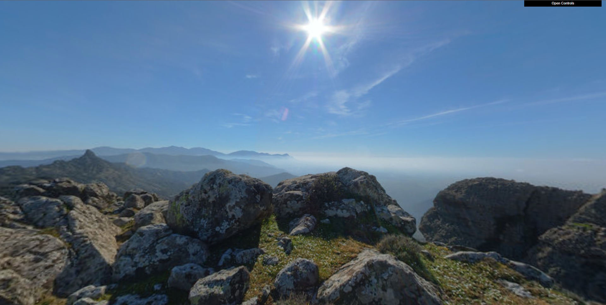

# Computer Graphics (L.EIC)
## Project 2022/2023

## Objectives

The aim of this project is to create a scene that combines the different elements explored in previous
classes. 

The scene, at the end of the project, contains a:
- A terrain with elevations, created by a shader;
- A forest, composed of trees using billboards;
- A bird, animated and controlled by the user, as well as its nest;
- A cluster of eggs scattered across the land.

The following points describe the main characteristics of the different intended elements. 
Some freedom is given as to their composition in the scene, so that we can create our own creative scene.

 

### **1. Sphere Creation**

We firstly started with creating a new 3D object, a sphere. This sphere, just like most of the objects we create throughout the project, are totally costumizable. We can change the number of stacks and the number of slices, to adjust both complexity and performance.

To try out the sphere in scene, we also applied a globe texture to it. We had to keep in mind that for this type of objects, the textures must be equirectangular, so that they can be applied correctly, without visible distortions.

 

### **2. Creation of Panoramas**

We then created a panorama, using the sphere we created before. Beforehand, we had to invert its faces, so that we can apply the texture inside the sphere. We applied a 360º image of a mountain, which was given to us at the creation of the project at the root of this repository.

It was applied a radius of 200 units to the sphere, which was the most desirable value for the FOV we were using, as well as the amount of slices and stacks, that are both 24.

