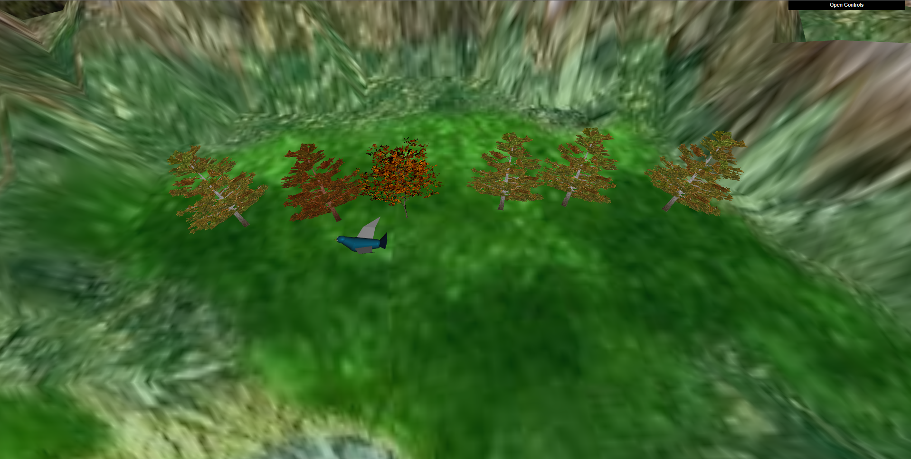

# Computer Graphics (L.EIC)
## Project 2022/2023

# TODO LIST

- [ ] Add size randomness to trees (Optional) need to fix treePlane, ez fix
- [ ] Fix bird animation, texture and shader
- [X] Add water shader (Optional)
- [X] Add follow bird camera

## Objectives

The aim of this project is to create a scene that combines the different elements explored in previous
classes. 

The scene, at the end of the project, contains a:
- A terrain with elevations, created by a shader;
- A forest, composed of trees using billboards;
- A bird, animated and controlled by the user, as well as its nest;
- A cluster of eggs scattered across the land.

The following points describe the main characteristics of the different intended elements. 
Some freedom is given as to their composition in the scene, so that we can create our own creative scene.

 

### **1. Sphere Creation**

We firstly started with creating a new 3D object, a sphere. This sphere, just like most of the objects we create throughout the project, are totally costumizable. We can change the number of stacks and the number of slices, to adjust both complexity and performance.

To try out the sphere in scene, we also applied a globe texture to it. We had to keep in mind that for this type of objects, the textures must be equirectangular, so that they can be applied correctly, without visible distortions.

 

### **2. Creation of Panoramas**

We then created a panorama, using the sphere we created before. Beforehand, we had to invert its faces, so that we can apply the texture inside the sphere. We applied a 360º image of a mountain, which was given to us at the creation of the project at the root of this repository.

It was applied a radius of 200 units to the sphere, which was the most desirable value for the FOV we were using, as well as the amount of slices and stacks, that are both 24.

 

### **3. Inclusion of a Bird**

We then included a bird in the scene. We had to create a new shader for the bird, which was a simple shader that applied a texture to the bird, and also applied a specular light to it.

#### **3.1. Bird modeling**

The bird was modeled manually, inside webgl. We used a simple bird model, with 5 main body parts: the head (with eyes and beak), the body, the tail, the left and the right wings. We also created a simple texture for the bird, which was applied to the bird in the shader.

#### **3.2. Bird animation**

The bird was animated using a simple animation, which has a simple movement of the bird's wings up and down. 

#### **3.3. Bird Control**

We also added the possibility to move forward/break, using the keys `W` and `S`, as well as turn sideways, with `A` and `D`. The speed of the animation is controlled by the `speedFactor` variable.

Also, further on development we added the possibility for the players to focus on the bird, by pressing the `F` key. This will make the camera follow the bird as a common third person view. We can also detach from the bird by pressing the key again. 

There is also a possibility to change the focus distance, as well as the top-down view angle: 
- `V` - Increases the distance to the bird
- `B` - Decreases the distance to the bird
- `T` - Increases the top-down view angle
- `G` - Decreases the top-down view angle

 

### **4. Terrain**

We then created a terrain, using a shader. The terrain is composed of a plane, which is manipulated on the shader, using a heightmap. The heightmap is a texture that contains the height of each point of the grid, which is then used to create the distortion desired on the plane. The main texture of the terrain is mixed with the altimetry, whose value is obtained from the heightmap - this ranges from water, to grass, to rocks, as well as mountain peaks.

(Keep in mind the bird is scalled, to be visible on the pictures)

### **5. Eggs and Nest**

# TODO

Eggs were implemented using 1 half sphere. The top part was scaled so it would seem more less round than the bottom part, therefore forming a more realistic egg shape. 
Nest was implemented by using a half sphere, however the half sphere had to be divided in two parts. The outside half sphere and the inside half sphere. By combining a default hide sphere with a modified half sphere just as the panoram sphere the egg texture would be visible on both outside and inside. 
In addition, in order to implement the bird egg catch we added the fly and dive state (activated by pressing the Key "P"), which were responsible for monitoring the bird movement and handling it in a two second time span and making the movement liner on the XZ plane. 
Finally, egg drop was implemented by adding a state drop, which would be activated as soon as the Key "O" as pressed. When the egg is close to the nest it is dropped and a position is assigned acording to a predefined position.

 

### **6. Integration of Trees**

In order to enrich the environment, we added a forest of trees, using billboards.

, and a specular light, which is applied to the texture. The trees are then scattered across the terrain, using a random function, which places the trees in random positions, with random rotations and scales.

#### **6.1. Billboard creation**

The trees are created using a billboard shader, which is applied to a simple quad. The shader is composed of a texture, which is applied to the quad. The texture is a simple image of a tree, with a transparent background.

They also have to be always facing the camera, on the XZ axis, so that they can be seen from any angle. This is done by calculating the angle between the camera and the tree, and then rotating the tree by that angle. 

We applied 3 different textures to the trees:
- Tree 1: Is the tree texture given in the root of the repository;
- Tree 2: Is the same texture as Tree 1, but with a different color adjustment;
- Tree 3: This tree textures was taken from [Victor Andrade Pinterest's page](https://br.pinterest.com/pin/489625790735154099/)

#### **6.2. Grove of trees**

The trees are either packer on a group of 9 trees (plot of 3x3), or on a row of 6 trees. The grooves are placed in a selected position, and their position, between themselfs, is random, so that they don't appear fully aligned at any instance. This is generated at run time, so that the trees are not always in the same position.

Also, the texture taken by the tree is also random, so that the trees are not always the same.

This is an example of the generation of a group of trees:

This is an example of the generation of a row of trees:

 

### **7. Additional developments**

From the possible aditional developments, we decided to implement the deformation of trees with the wind, based on the displacement of vertices of the respective
quads.

To achieve this goal, we used a noise function, which is applied to the vertices of the trees, in the vertex shader. This function is applied to the vertices, based on the time, which is incremented at each frame. This creates a wave-like movement, which is applied to the trees, as if they were being moved by the wind.

### **8. Complementary Development**

We added a water texture to the scene, that covers all the lowerside of the terrain. This texture is applied to a plane, which is placed below the terrain, and is also animated, using a simple animation provinient from the TP5, which moves the texture in the X and Y axis, creating the illusion of movement. We also applied a wave and a tidal effect to it.

