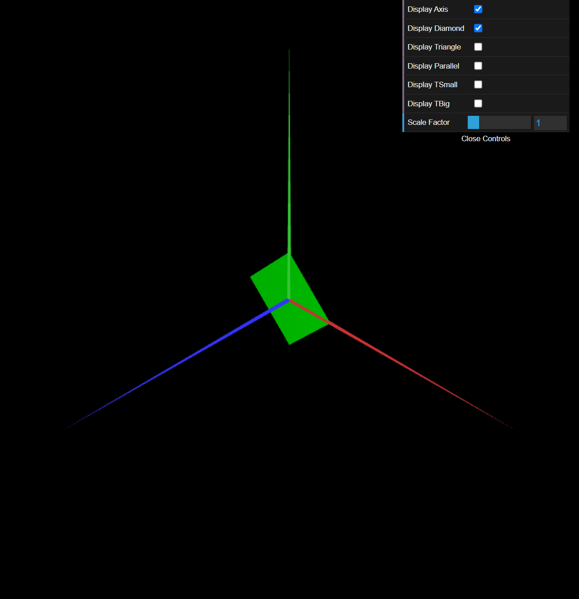
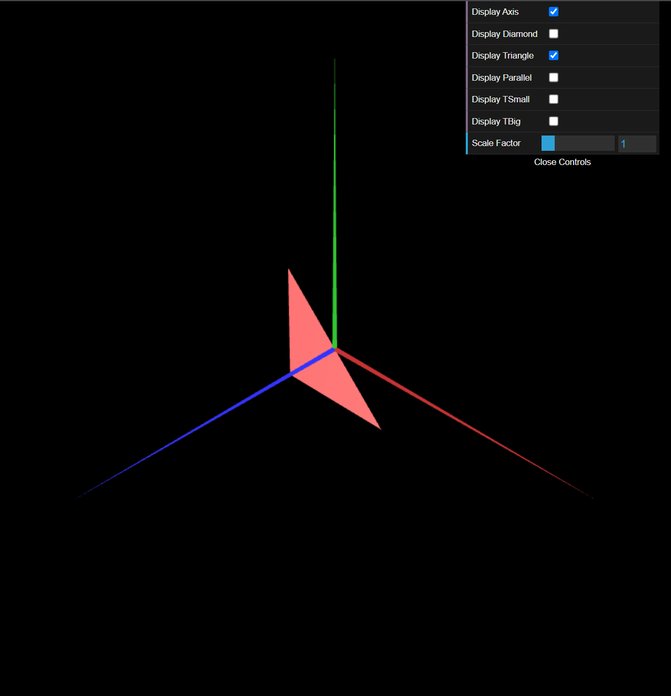
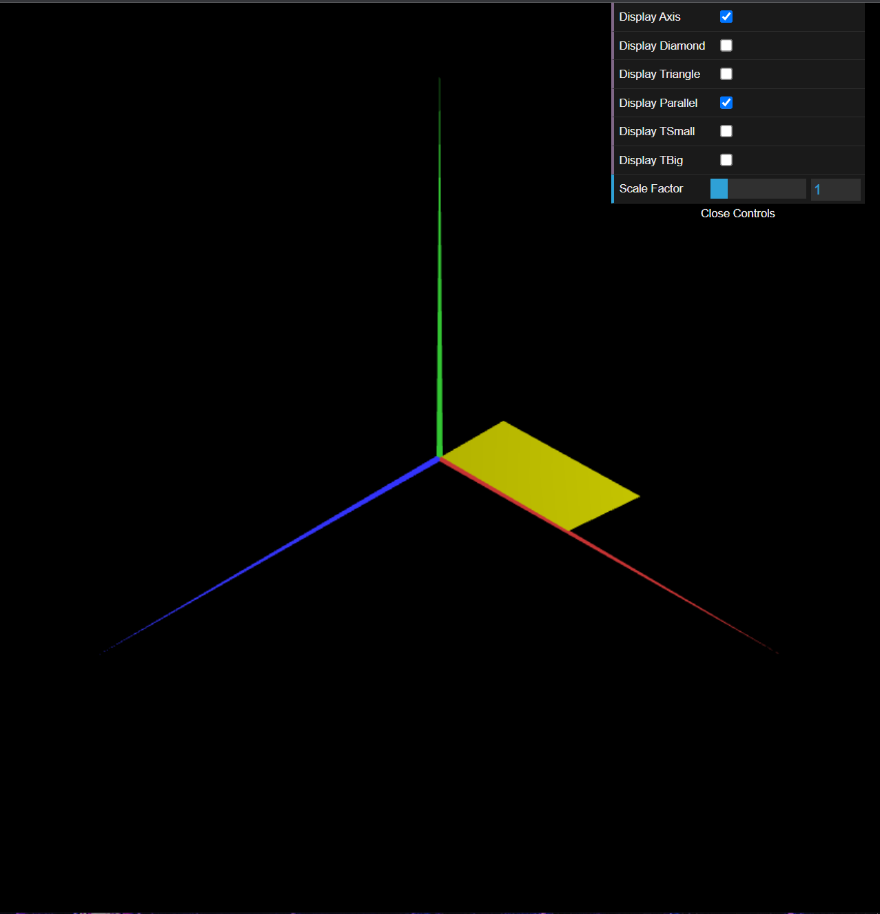
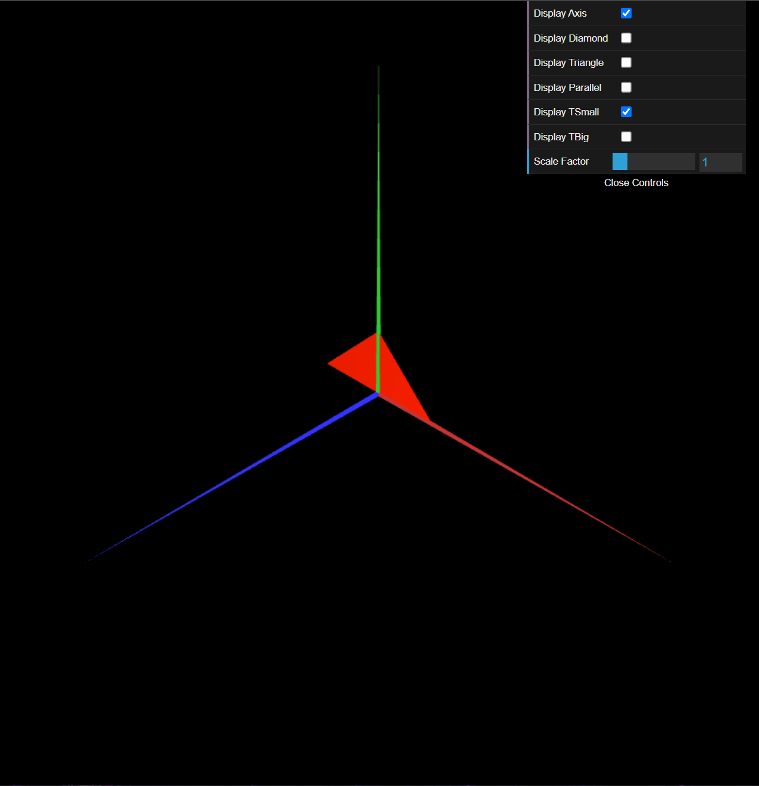
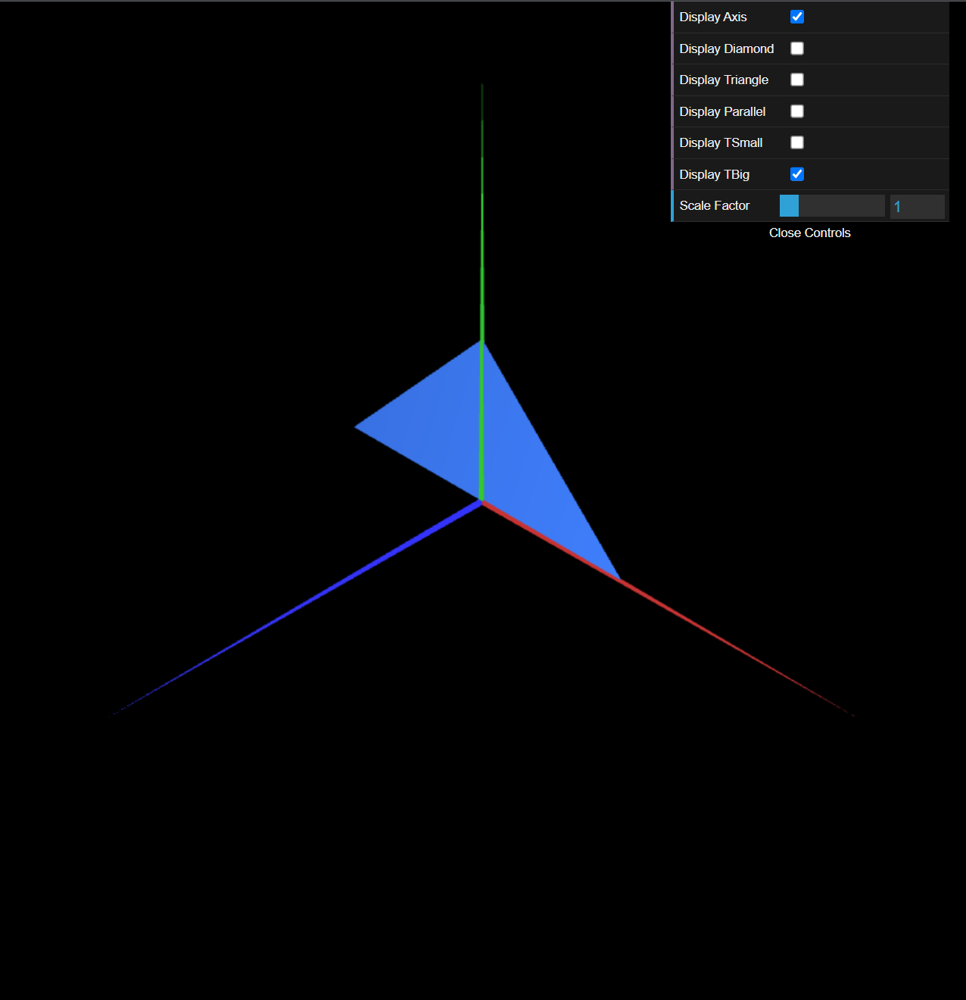

# CG 2022/2023

## Group T05G05

## TP 1 Notes

### **Global Notes**

- Each object has the correspondent color given in the statement.

### **Exercise 1**

- In exercise 1, we noticed that displaying multiple objects at once (or even alternating between them) wasn't that hard, in fact, it was quite intuitive with the given diamond example. In order to display both sides of the parallelogram, it was also intuitive.

### **Exercise 2**

- For this one, since we had already made a triangle on the previous exercice, we essencially just had to copy and paste the class, changing the position of the vertices in space.

