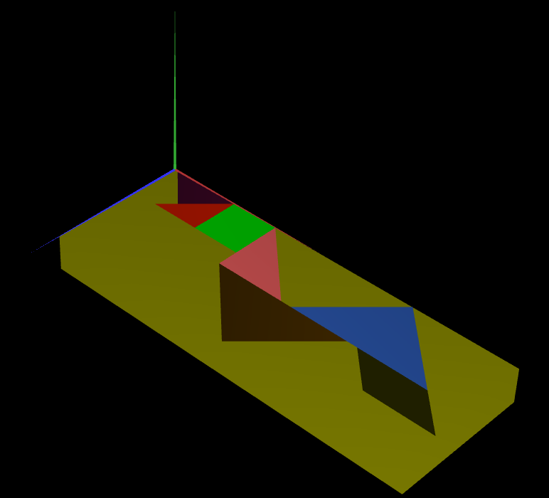
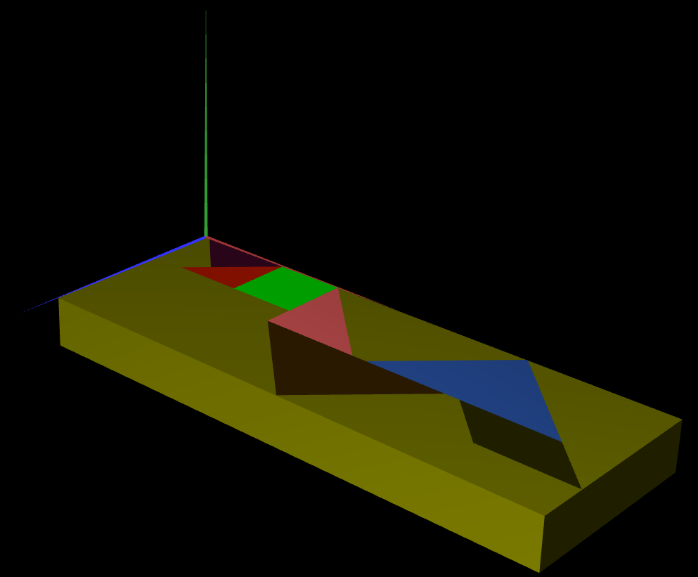

# CG 2022/2023

## Group T05G05

## TP 2 Notes

### **Global Notes**

- ...

### **Exercise 1**

- In exercise 1 we find at first some problems due to applying the matrix of the rotations before applying the translation, we noticed that right away and we were able to build the remaining pieces of the tangram with ease.

### **Exercise 2**

- We didn't really find any problems with this exercice, it was straight forward to create the cube. Althought we may add that we found a particular interest with the fact that the cube, which was shaped to fill the tangram, had the same light shade across it.

### **Exercise 3**

- Once more, we didn't find any problems with this one, although, here we noticed that the lights across the sides were now fixed and working as suposed. We search a bit and we found out what was going on, and it was going to be a subject for tp3

