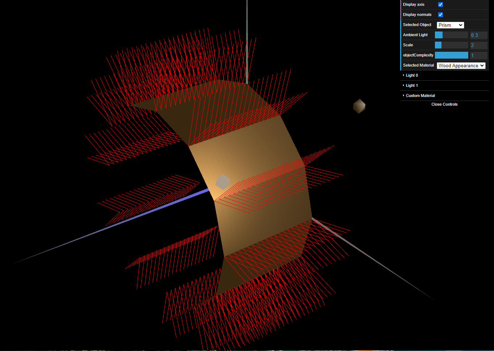

# CG 2022/2023

## Group T05G05

## TP 3 Notes

### **Exercise 1**

- In exercise 1 we didn't have many difficulties working around the materials to be applied in the unit cube. However, in the tangram, we had some problems with the materials because we missed creating the normal vectors, after that, it was pretty straightforward.  

---

### **Exercise 2**

- In exercise 2, there were some problems creating the indices list and setting up an order of vertices that would make it easier to create the cylinder as the normal vectors of a side of the prism are all equal in every point, then the color will be the same in every point of that side. So this is the same as calculating the color in one point and replicating it in all points (that is the definition of constant shading).

### **Exercise 3**

- In exercise 3 we found ourselves in the same problem trying to reduce the number of vertices and simplifying its order to be easier create the indices list. 
- In the end, we iterated through each edge of the cylinder and added the vertices to the list according to the order of iteration (from the base in the xy plane to the other one).

