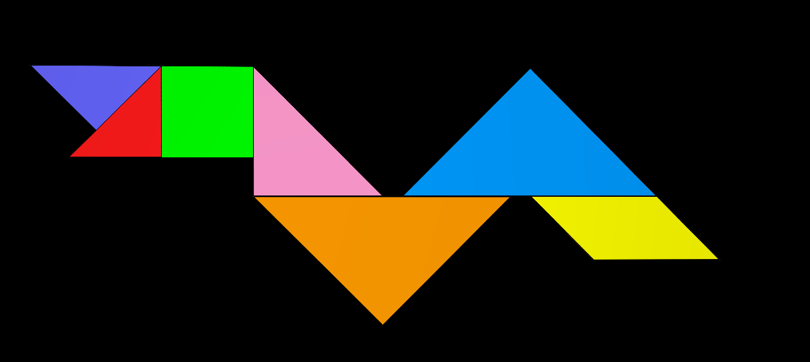
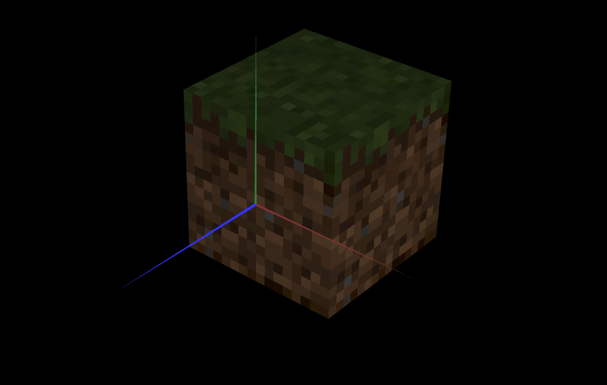

# CG 2022/2023

## Group T05G05

## TP 4 Notes

### **Global Notes**

- ...

### **Exercise 1**

- In exercise 1 we didn't many problems in mapping the texture coordinates to the tangram, it just took some work getting the those coordinates from original tangram image and also calculating all the tranformations to get the textures in the right place of the tangram.

- In exercise 2 we also just had to be careful with the translations and rotations of the scene to set the cube textures.

