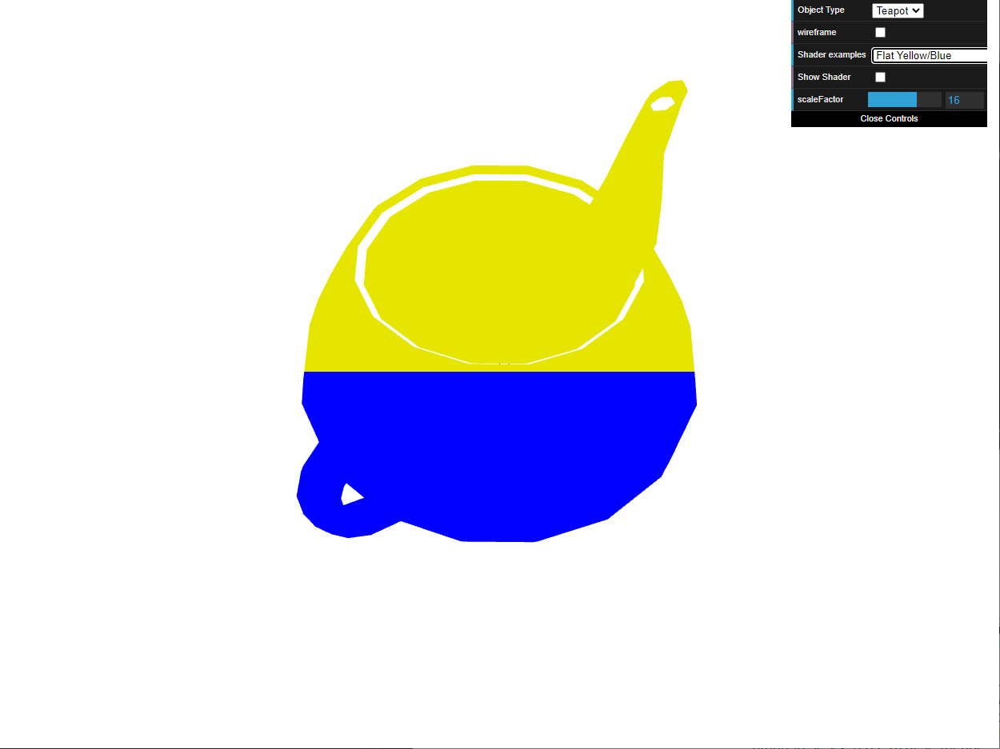
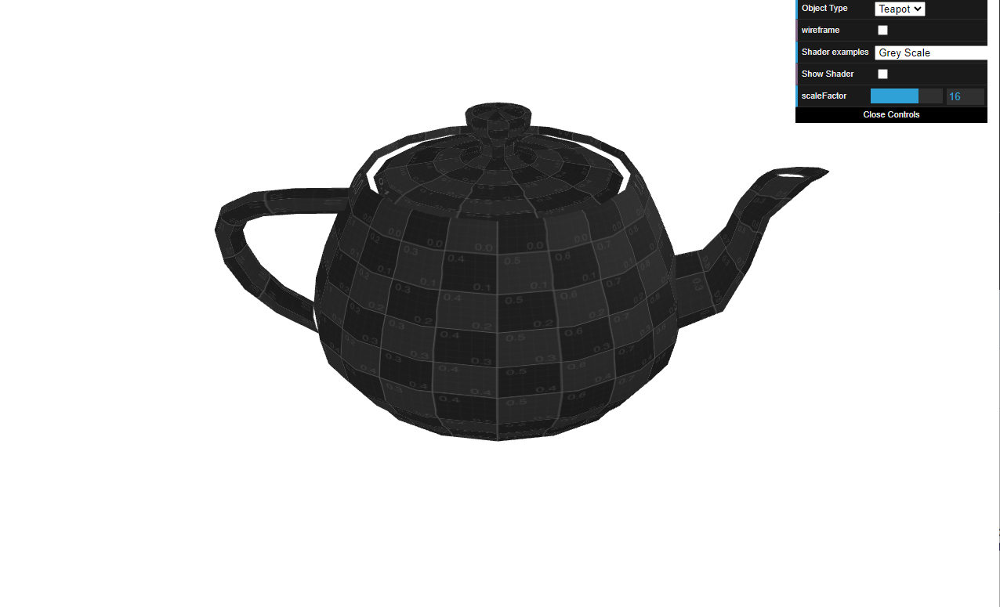
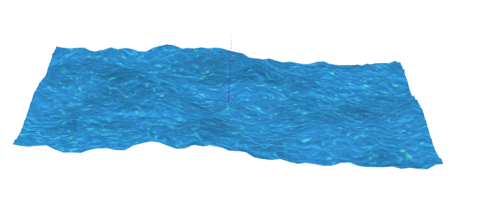

# CG 2022/2023

## Group T05G05

## TP 5 Notes

### **Global Notes**

- ...

### **Exercise 1**

- In exercise 1 we didn't have any problems, it was pretty straight forward to create the vertex and fragment shaders for the tea pot. It was also very simple to change the animation shader to give the expected look.

### **Exercise 1**

- In exercise 2 there weren't any difficulties too, we just took some time creating the shaders but with no troubles.

